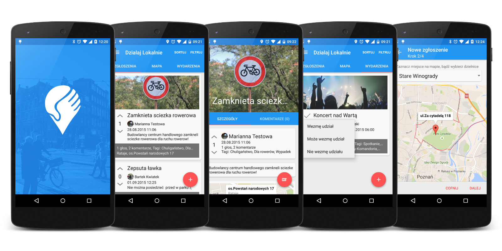

Działaj Lokalnie w Poznaniu
===========================

Krótki opis
-----------

Zwycięska aplikacja hakatonu NeedApp Poznań zorganizowanego przez ECDF mKlaster i Urząd Miasta Poznania. Zadaniem uczestników było opracowanie aplikacji, która pomoże zmobilizować mieszkańców do aktywnego udziału w kształtowaniu obrazu ich otoczenia. Zrealizowana przez firmę Snowdog https://snow.dog Kod źródłowy jest dostępny na zasadach open-source.

Funkcjonalność
--------------

Aplikacja pozwala na zgłaszanie pomysłów nt. życia lokalnej społeczności, ocenianie ich przez użytkowników i dyskutowanie na ich temat w komentarzach. 
Pozwola również na dodawanie i dołączanie do wydarzeń. 
Zgłoszenia i wydarzenia są prezentowane na mapie i listach.
Użytkownik jest powiadamiany o aktywności we zgłoszeniach i wydarzeniach za pomocą push notifications.
Użytkownik może się zalogować poprzez adres e-mail i hasło lub z wykorzystaniem Facebooka.

Media nt. konkursu i apliakcji
------------------------------

http://www.poznan.pl/mim/info/news/aplikacja-zmobilizuje-poznaniakow,82820.html
http://poznan.naszemiasto.pl/artykul/needapp-poznan-snowdog-zwyciezyl-stworza-aplikacje-miejska,3430459,artgal,t,id,tm.html

Zaangażowani w powstanie aplikacji
----------------------------------

[Snowdog] [snowdog]

[Miasto Poznań] [poznan]

[ECDF mKlaster] [mklaster]

Licencja
--------

    Copyright 2015 Snowdog, Inc.

    Licensed under the Apache License, Version 2.0 (the "License");
    you may not use this file except in compliance with the License.
    You may obtain a copy of the License at

       http://www.apache.org/licenses/LICENSE-2.0

    Unless required by applicable law or agreed to in writing, software
    distributed under the License is distributed on an "AS IS" BASIS,
    WITHOUT WARRANTIES OR CONDITIONS OF ANY KIND, either express or implied.
    See the License for the specific language governing permissions and
    limitations under the License.
    
[snowdog]: https://snow.dog
[poznan]: http://www.poznan.pl
[mklaster]: http://mklaster.pl
